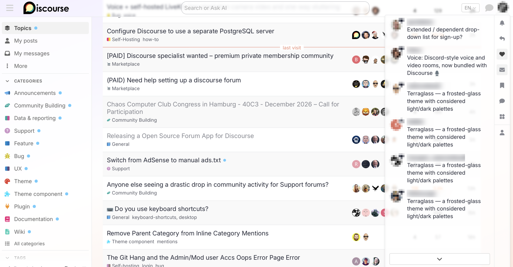
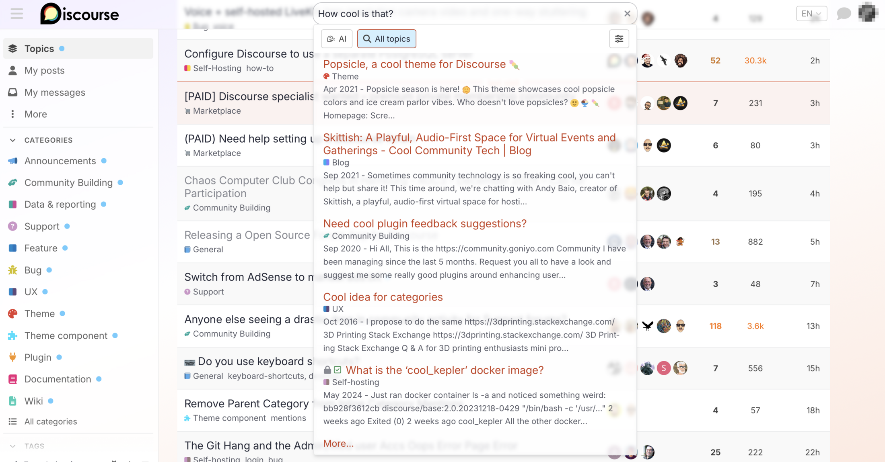
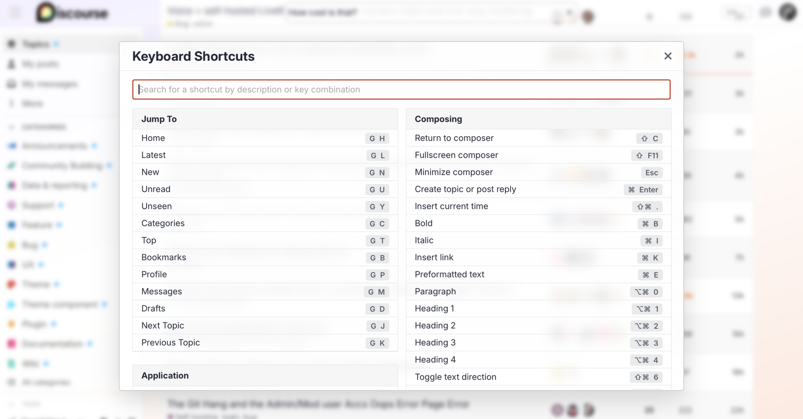
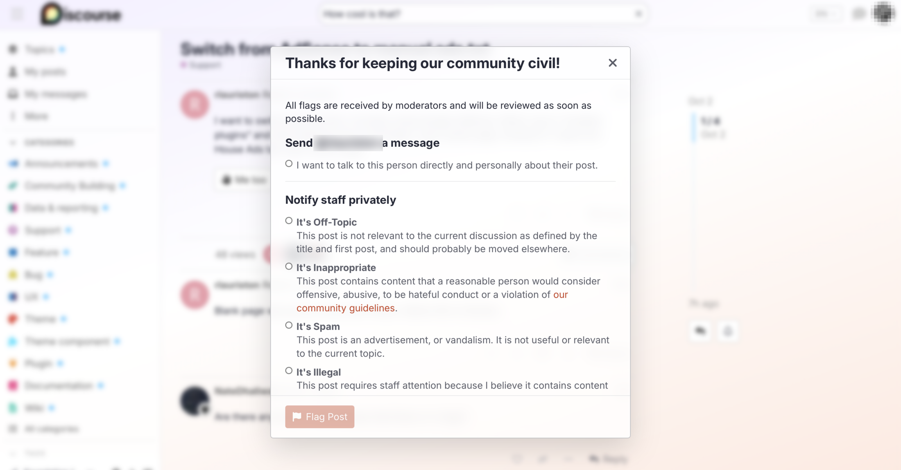

# Terraglass

A clean, modern Discourse theme built around translucent, frosted-glass surfaces (header, sidebar, search) with a considered light and dark color scheme, tied entirely to Discourse's CSS custom properties — no hardcoded colors, works out of the box with automatic light/dark switching.

## Features

- **Frosted glass look** — the header, sidebar and search field are semi-transparent with a soft blur, so the page shows through faintly instead of a solid bar. Opacity and blur strength are both adjustable.
- **Glass menus and dialogs** — dropdown menus and dialogs share the frosted look, with a thin hairline edge and a faint highlight along the top. Behind a dialog the page is blurred instead of darkened. Opacity and blur are adjustable separately for menus and dialogs.
- **Optional header tint** — give the header a subtle color of your choice. Either follows the accent color of the active color scheme (switching along with light/dark) or uses any custom color, with adjustable strength. In Safari, the browser's toolbar area is tinted to match. Off by default.
- **Light and dark color schemes** — designed as a matching pair, not just one scheme inverted, and checked for good text contrast in both.
- **Nicer link previews** — link cards (oneboxes) get a thin border and rounded corners, similar to how X/Twitter shows link previews.
- **Flag-shaped tags** instead of plain pill-shaped labels.
- **Consistent video size** — embedded videos always keep a 16:9 shape, on any device.
- **Striped topic list** with a subtle hover highlight.
- **Adjustable corner rounding** across buttons, cards, modals and input fields.
- **Clear focus outline** for keyboard navigation, using the scheme's own text color so it's always visible.
- Every feature above is a theme setting — turn off or fine-tune anything you don't want.

## Screenshots

Light color scheme, shown on a Discourse forum.

**Notifications menu** — translucent, with the page showing through:



**Search dropdown** — frosted field and results panel:



**Dialogs** — the page behind is blurred instead of darkened:





## Installation

In your Discourse admin, go to *Customize → Themes → Install → From a git repository* and paste:

```
https://github.com/terraboss/discourse-terraglass
```

This also gives you one-click "Check for updates" going forward.

## Light/dark mode

This theme ships two color schemes, **Terraglass Light** and **Terraglass Dark**. You can pick either one directly under *Customize → Colors*.

To have Discourse switch between them automatically based on the visitor's system setting:

1. Select **Terraglass Light** and set it as the default/light scheme.
2. Select **Terraglass Dark** and mark it as the dark-mode scheme (the option sits next to the color palette list).

No separate "dark mode" component needed — this is handled natively by Discourse.

## Settings

| Setting | Default | Description |
|---|---|---|
| `corner_radius` | `5` | Corner rounding (px) for buttons, cards and inputs. `0` = square. |
| `topic_list_zebra` | on | Subtle zebra striping + hover on the topic list. |
| `hide_subcategories_in_hamburger` | off | Hide subcategories in the classic hamburger menu (usually unneeded once the sidebar is active). |
| `composer_accent` | on | Color the composer's resize handle in the accent color. |
| `hide_uncategorized_in_menu` | on | Hide the "Uncategorized" entry from the hamburger menu (topics stay visible in lists). |
| `transparent_header` | on | Semi-transparent, blurred header. |
| `header_opacity` | `20` | Header opacity in %. |
| `header_blur` | `3` | Header backdrop blur strength (px). |
| `header_tint` | off | Tint the header with an accent color. |
| `header_tint_source` | `auto` | `auto` follows the active color scheme's accent color; `custom` uses `header_tint_color`. |
| `header_tint_color` | `#c8401f` | Tint color for `custom` mode. Any CSS color. |
| `header_tint_strength` | `15` | Tint strength in % (0 = none, 100 = solid). |
| `pretty_tags` | on | Flag/arrow-shaped tags instead of plain pills. |
| `pretty_videos` | on | Fixed 16:9 video embeds on every device. |
| `pretty_oneboxes` | on | Hairline-bordered, rounded link preview cards. |
| `onebox_radius` | `14` | Corner radius (px) of onebox cards. |
| `transparent_sidebar` | on | Semi-transparent, blurred sidebar/hamburger menu. |
| `sidebar_opacity` | `80` | Sidebar opacity in %. Kept higher than the header so menu items stay legible. |
| `sidebar_blur` | `3` | Sidebar backdrop blur strength (px). |
| `glass_surfaces` | on | Frosted-glass look for dropdown menus and dialogs. |
| `menu_opacity` | `65` | Opacity of glass dropdown menus in %. |
| `menu_blur` | `6` | Backdrop blur strength behind dropdown menus (px). |
| `dialog_opacity` | `80` | Opacity of glass dialogs in %. |
| `dialog_blur` | `10` | Backdrop blur strength behind dialogs (px). |

## License

MIT — see [LICENSE](LICENSE).
